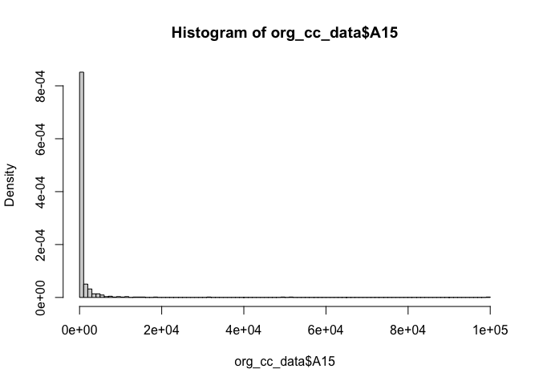
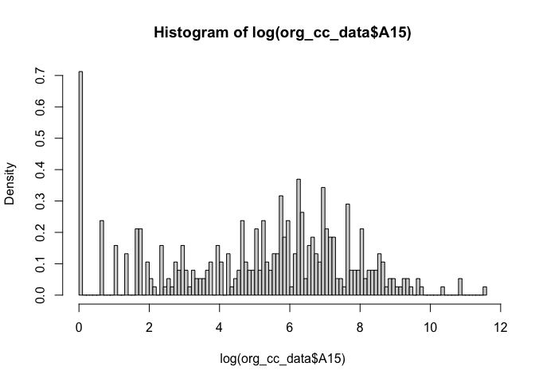

SVM modelling iterations Ashish
================

``` r
library(kernlab)
library(ggplot2)
```

    ## 
    ## Attaching package: 'ggplot2'

    ## The following object is masked from 'package:kernlab':
    ## 
    ##     alpha

### Read Data

``` r
org_cc_data <- read.table(file = '../data 2.2/credit_card_data-headers.txt', sep = "\t", header = TRUE)
dim(org_cc_data)
```

    ## [1] 654  11

``` r
names(org_cc_data)
```

    ##  [1] "A1"  "A2"  "A3"  "A8"  "A9"  "A10" "A11" "A12" "A14" "A15" "R1"

### v0: Vanilla Model and Accuracy

``` r
model_v0 = ksvm(x=as.matrix(org_cc_data[,1:10]), y=org_cc_data[,11], scaled =TRUE, type = "C-svc",kernel = "vanilladot", C = 10)
```

    ##  Setting default kernel parameters

``` r
#model_v0

acc_func <- function(model) {
   pred_all <- predict(model,org_cc_data[,1:10])
   print (paste("Overall Acc:", round(sum(pred_all == org_cc_data[,11]) * 100 / nrow(org_cc_data),4)))
   
   pred_1 <- predict(model,org_cc_data[org_cc_data$R1 == 1,1:10])
   print (paste("Acc in 1's:", round(sum(pred_1 == org_cc_data[org_cc_data$R1 == 1,11]) * 100 / nrow(org_cc_data[org_cc_data$R1 == 1,1:10]),4)))
   
   pred_0 <- predict(model,org_cc_data[org_cc_data$R1 == 0,1:10])
   print (paste("Acc in 0's:", round(sum(pred_0 == org_cc_data[org_cc_data$R1 == 0,11]) * 100 / nrow(org_cc_data[org_cc_data$R1 == 0,1:10]),4)))
}

acc_func(model_v0)
```

    ## [1] "Overall Acc: 86.3914"
    ## [1] "Acc in 1's: 94.2568"
    ## [1] "Acc in 0's: 79.8883"

### v1: Optimise C: Find best window for linear search

``` r
C_values <- c(0.0001,0.001,0.0015,0.002,0.005,0.01,0.03)

for (C_i in C_values) {
  print (paste("For C = ",C_i))
  acc_func(ksvm(x=as.matrix(org_cc_data[,1:10]), y=org_cc_data[,11], scaled =TRUE, type = "C-svc",kernel = "vanilladot", C = C_i))
  print("")
}
```

    ## [1] "For C =  1e-04"
    ##  Setting default kernel parameters  
    ## [1] "Overall Acc: 54.7401"
    ## [1] "Acc in 1's: 0"
    ## [1] "Acc in 0's: 100"
    ## [1] ""
    ## [1] "For C =  0.001"
    ##  Setting default kernel parameters  
    ## [1] "Overall Acc: 83.792"
    ## [1] "Acc in 1's: 73.6486"
    ## [1] "Acc in 0's: 92.1788"
    ## [1] ""
    ## [1] "For C =  0.0015"
    ##  Setting default kernel parameters  
    ## [1] "Overall Acc: 86.3914"
    ## [1] "Acc in 1's: 86.4865"
    ## [1] "Acc in 0's: 86.3128"
    ## [1] ""
    ## [1] "For C =  0.002"
    ##  Setting default kernel parameters  
    ## [1] "Overall Acc: 86.3914"
    ## [1] "Acc in 1's: 94.2568"
    ## [1] "Acc in 0's: 79.8883"
    ## [1] ""
    ## [1] "For C =  0.005"
    ##  Setting default kernel parameters  
    ## [1] "Overall Acc: 86.3914"
    ## [1] "Acc in 1's: 94.2568"
    ## [1] "Acc in 0's: 79.8883"
    ## [1] ""
    ## [1] "For C =  0.01"
    ##  Setting default kernel parameters  
    ## [1] "Overall Acc: 86.3914"
    ## [1] "Acc in 1's: 94.2568"
    ## [1] "Acc in 0's: 79.8883"
    ## [1] ""
    ## [1] "For C =  0.03"
    ##  Setting default kernel parameters  
    ## [1] "Overall Acc: 86.3914"
    ## [1] "Acc in 1's: 94.2568"
    ## [1] "Acc in 0's: 79.8883"
    ## [1] ""

### v2: vanilla but capping A15

``` r
hist(org_cc_data$A15, freq = FALSE, breaks = 100)
```

<!-- -->

``` r
hist(log(org_cc_data$A15), freq = FALSE, breaks = 100)
```

<!-- -->

``` r
#lines(density(x))


cc_data1 = org_cc_data
cc_data1$A15 = log(0.001 + cc_data1$A15)
acc_func(ksvm(x=as.matrix(cc_data1[,1:10]), y=cc_data1[,11], scaled =TRUE, type = "C-svc",kernel = "vanilladot", C = 0.007))
```

    ##  Setting default kernel parameters  
    ## [1] "Overall Acc: 86.2385"
    ## [1] "Acc in 1's: 93.9189"
    ## [1] "Acc in 0's: 79.8883"

### Final model and equation

``` r
modelf = ksvm(x=as.matrix(org_cc_data[,1:10]), y=org_cc_data[,11], scaled =TRUE, type = "C-svc",kernel = "vanilladot", C = 0.0015)
```

    ##  Setting default kernel parameters

``` r
acc_func(modelf)
```

    ## [1] "Overall Acc: 86.3914"
    ## [1] "Acc in 1's: 86.4865"
    ## [1] "Acc in 0's: 86.3128"

``` r
a <- colSums(modelf@xmatrix[[1]] * modelf@coef[[1]])
a0 <- -modelf@b
a0
```

    ## [1] -0.1072752

### Non Linear models: Radial Basis Kernel

``` r
C_values <- c(0.01,1,10,50,100,1000,2000)

for (C_i in C_values) {
  print (paste("For C = ",C_i))
  modeli = ksvm(x=as.matrix(org_cc_data[,1:10]), y=org_cc_data[,11], scaled =TRUE, type = "C-svc",kernel = "rbfdot", C = C_i)
  acc_func(modeli)
  print(modeli@nSV)
}
```

    ## [1] "For C =  0.01"
    ## [1] "Overall Acc: 56.5749"
    ## [1] "Acc in 1's: 4.0541"
    ## [1] "Acc in 0's: 100"
    ## [1] 593
    ## [1] "For C =  1"
    ## [1] "Overall Acc: 87.156"
    ## [1] "Acc in 1's: 94.2568"
    ## [1] "Acc in 0's: 81.2849"
    ## [1] 271
    ## [1] "For C =  10"
    ## [1] "Overall Acc: 90.0612"
    ## [1] "Acc in 1's: 92.5676"
    ## [1] "Acc in 0's: 87.9888"
    ## [1] 251
    ## [1] "For C =  50"
    ## [1] "Overall Acc: 94.8012"
    ## [1] "Acc in 1's: 93.2432"
    ## [1] "Acc in 0's: 96.0894"
    ## [1] 252
    ## [1] "For C =  100"
    ## [1] "Overall Acc: 95.107"
    ## [1] "Acc in 1's: 93.5811"
    ## [1] "Acc in 0's: 96.3687"
    ## [1] 244
    ## [1] "For C =  1000"
    ## [1] "Overall Acc: 98.4709"
    ## [1] "Acc in 1's: 97.6351"
    ## [1] "Acc in 0's: 99.162"
    ## [1] 221
    ## [1] "For C =  2000"
    ## [1] "Overall Acc: 98.7768"
    ## [1] "Acc in 1's: 97.6351"
    ## [1] "Acc in 0's: 99.7207"
    ## [1] 216

### Non Linear models: Laplace Kernel

``` r
C_values <- c(0.01,1,10,50,100,1000,2000)

for (C_i in C_values) {
  print (paste("For C = ",C_i))
  modeli = ksvm(x=as.matrix(org_cc_data[,1:10]), y=org_cc_data[,11], scaled =TRUE, type = "C-svc",kernel = "laplacedot", C = C_i)
  acc_func(modeli)
  print(modeli@nSV)
}
```

    ## [1] "For C =  0.01"
    ## [1] "Overall Acc: 54.7401"
    ## [1] "Acc in 1's: 0"
    ## [1] "Acc in 0's: 100"
    ## [1] 594
    ## [1] "For C =  1"
    ## [1] "Overall Acc: 86.3914"
    ## [1] "Acc in 1's: 94.2568"
    ## [1] "Acc in 0's: 79.8883"
    ## [1] 356
    ## [1] "For C =  10"
    ## [1] "Overall Acc: 95.2599"
    ## [1] "Acc in 1's: 95.6081"
    ## [1] "Acc in 0's: 94.9721"
    ## [1] 363
    ## [1] "For C =  50"
    ## [1] "Overall Acc: 99.6942"
    ## [1] "Acc in 1's: 99.3243"
    ## [1] "Acc in 0's: 100"
    ## [1] 377
    ## [1] "For C =  100"
    ## [1] "Overall Acc: 100"
    ## [1] "Acc in 1's: 100"
    ## [1] "Acc in 0's: 100"
    ## [1] 377
    ## [1] "For C =  1000"
    ## [1] "Overall Acc: 100"
    ## [1] "Acc in 1's: 100"
    ## [1] "Acc in 0's: 100"
    ## [1] 379
    ## [1] "For C =  2000"
    ## [1] "Overall Acc: 100"
    ## [1] "Acc in 1's: 100"
    ## [1] "Acc in 0's: 100"
    ## [1] 377
