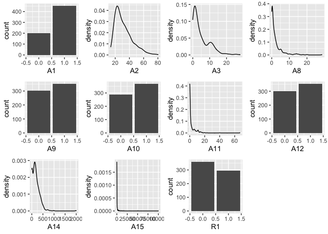
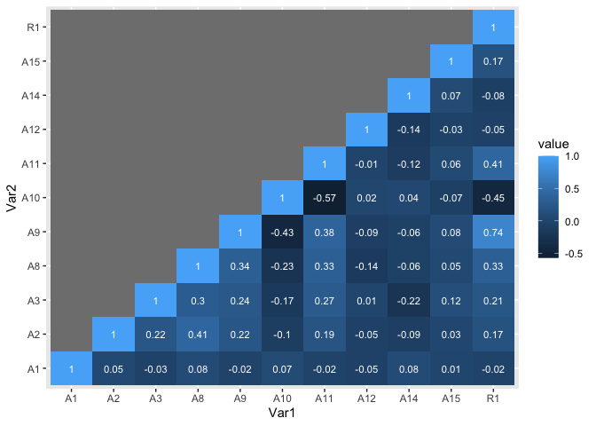

R Notebook
================

``` r
#imports
library(cowplot)
library(ggplot2)
library(reshape2)
```

### Credit Card Data Intro EDA

1.  Read data

``` bash
head -5 ./data\ 2.2/credit_card_data.txt
```

    ## 1    30.83   0   1.25    1   0   1   1   202 0   1
    ## 0    58.67   4.46    3.04    1   0   6   1   43  560 1
    ## 0    24.5    0.5 1.5 1   1   0   1   280 824 1
    ## 1    27.83   1.54    3.75    1   0   5   0   100 3   1
    ## 1    20.17   5.625   1.71    1   1   0   1   120 0   1

``` r
org_cc_data <- read.table(file = './data 2.2/credit_card_data-headers.txt', sep = "\t", header = TRUE)
dim(org_cc_data)
```

    ## [1] 654  11

``` r
class(org_cc_data)
```

    ## [1] "data.frame"

``` r
org_cc_data
```

    ##     A1    A2     A3     A8 A9 A10 A11 A12  A14    A15 R1
    ## 1    1 30.83  0.000  1.250  1   0   1   1  202      0  1
    ## 2    0 58.67  4.460  3.040  1   0   6   1   43    560  1
    ## 3    0 24.50  0.500  1.500  1   1   0   1  280    824  1
    ## 4    1 27.83  1.540  3.750  1   0   5   0  100      3  1
    ## 5    1 20.17  5.625  1.710  1   1   0   1  120      0  1
    ## 6    1 32.08  4.000  2.500  1   1   0   0  360      0  1
    ## 7    1 33.17  1.040  6.500  1   1   0   0  164  31285  1
    ## 8    0 22.92 11.585  0.040  1   1   0   1   80   1349  1
    ## 9    1 54.42  0.500  3.960  1   1   0   1  180    314  1
    ## 10   1 42.50  4.915  3.165  1   1   0   0   52   1442  1
    ## 11   1 22.08  0.830  2.165  0   1   0   0  128      0  1
    ## 12   1 29.92  1.835  4.335  1   1   0   1  260    200  1
    ## 13   0 38.25  6.000  1.000  1   1   0   0    0      0  1
    ## 14   1 48.08  6.040  0.040  0   1   0   1    0   2690  1
    ## 15   0 45.83 10.500  5.000  1   0   7   0    0      0  1
    ## 16   1 36.67  4.415  0.250  1   0  10   0  320      0  1
    ## 17   1 28.25  0.875  0.960  1   0   3   0  396      0  1
    ## 18   0 23.25  5.875  3.170  1   0  10   1  120    245  1
    ## 19   1 21.83  0.250  0.665  1   1   0   0    0      0  1
    ## 20   0 19.17  8.585  0.750  1   0   7   1   96      0  1
    ## 21   1 25.00 11.250  2.500  1   0  17   1  200   1208  1
    ## 22   1 23.25  1.000  0.835  1   1   0   1  300      0  1
    ## 23   0 47.75  8.000  7.875  1   0   6   0    0   1260  1
    ## 24   0 27.42 14.500  3.085  1   0   1   1  120     11  1
    ## 25   0 41.17  6.500  0.500  1   0   3   0  145      0  1
    ## 26   0 15.83  0.585  1.500  1   0   2   1  100      0  1
    ## 27   0 47.00 13.000  5.165  1   0   9   0    0      0  1
    ## 28   1 56.58 18.500 15.000  1   0  17   0    0      0  1
    ## 29   1 57.42  8.500  7.000  1   0   3   1    0      0  1
    ## 30   1 42.08  1.040  5.000  1   0   6   0  500  10000  1
    ## 31   1 29.25 14.790  5.040  1   0   5   0  168      0  1
    ## 32   1 42.00  9.790  7.960  1   0   8   1    0      0  1
    ## 33   1 49.50  7.585  7.585  1   0  15   0    0   5000  1
    ## 34   0 36.75  5.125  5.000  1   1   0   0    0   4000  1
    ## 35   0 22.58 10.750  0.415  1   0   5   0    0    560  1
    ## 36   1 27.83  1.500  2.000  1   0  11   0  434     35  1
    ## 37   1 27.25  1.585  1.835  1   0  12   0  583    713  1
    ## 38   0 23.00 11.750  0.500  1   0   2   0  300    551  1
    ## 39   1 27.75  0.585  0.250  1   0   2   1  260    500  1
    ## 40   1 54.58  9.415 14.415  1   0  11   0   30    300  1
    ## 41   1 34.17  9.170  4.500  1   0  12   0    0    221  1
    ## 42   1 28.92 15.000  5.335  1   0  11   1    0   2283  1
    ## 43   1 29.67  1.415  0.750  1   0   1   1  240    100  1
    ## 44   1 39.58 13.915  8.625  1   0   6   0   70      0  1
    ## 45   1 56.42 28.000 28.500  1   0  40   1    0     15  1
    ## 46   1 54.33  6.750  2.625  1   0  11   0    0    284  1
    ## 47   0 41.00  2.040  0.125  1   0  23   0  455   1236  1
    ## 48   1 31.92  4.460  6.040  1   0   3   1  311    300  1
    ## 49   1 41.50  1.540  3.500  0   1   0   1  216      0  1
    ## 50   1 23.92  0.665  0.165  0   1   0   1  100      0  1
    ## 51   0 25.75  0.500  0.875  1   1   0   0  491      0  1
    ## 52   1 26.00  1.000  1.750  1   1   0   0  280      0  1
    ## 53   1 37.42  2.040  0.040  1   1   0   0  400   5800  1
    ## 54   1 34.92  2.500  0.000  1   1   0   0  239    200  1
    ## 55   1 34.25  3.000  7.415  1   1   0   0    0      0  1
    ## 56   1 23.33 11.625  0.835  1   1   0   0  160    300  1
    ## 57   1 23.17  0.000  0.085  1   1   0   1    0      0  1
    ## 58   1 44.33  0.500  5.000  1   1   0   0  320      0  1
    ## 59   1 35.17  4.500  5.750  0   1   0   0  711      0  1
    ## 60   1 43.25  3.000  6.000  1   0  11   1   80      0  1
    ## 61   1 56.75 12.250  1.250  1   0   4   0  200      0  1
    ## 62   1 31.67 16.165  3.000  1   0   9   1  250    730  1
    ## 63   0 23.42  0.790  1.500  1   0   2   0   80    400  1
    ## 64   0 20.42  0.835  1.585  1   0   1   1    0      0  1
    ## 65   1 26.67  4.250  4.290  1   0   1   0  120      0  1
    ## 66   1 34.17  1.540  1.540  1   0   1   0  520  50000  1
    ## 67   0 36.00  1.000  2.000  1   0  11   1    0    456  1
    ## 68   1 25.50  0.375  0.250  1   0   3   1  260  15108  1
    ## 69   1 19.42  6.500  1.460  1   0   7   1   80   2954  1
    ## 70   1 35.17 25.125  1.625  1   0   1   0  515    500  1
    ## 71   1 32.33  7.500  1.585  1   1   0   0  420      0  0
    ## 72   0 38.58  5.000 13.500  1   1   0   0  980      0  0
    ## 73   1 44.25  0.500 10.750  1   1   0   1  400      0  0
    ## 74   1 44.83  7.000  1.625  0   1   0   1  160      2  0
    ## 75   1 20.67  5.290  0.375  1   0   1   1  160      0  0
    ## 76   1 34.08  6.500  0.125  1   1   0   0  443      0  0
    ## 77   0 19.17  0.585  0.585  1   1   0   0  160      0  0
    ## 78   1 21.67  1.165  2.500  1   0   1   1  180     20  0
    ## 79   1 21.50  9.750  0.250  1   1   0   1  140      0  0
    ## 80   1 49.58 19.000  0.000  1   0   1   1   94      0  0
    ## 81   0 27.67  1.500  2.000  1   1   0   1  368      0  0
    ## 82   1 39.83  0.500  0.250  1   1   0   1  288      0  0
    ## 83   1 27.25  0.625  0.455  1   1   0   0  200      0  0
    ## 84   1 37.17  4.000  5.000  1   1   0   0  280      0  0
    ## 85   1 25.67  2.210  4.000  1   1   0   1  188      0  0
    ## 86   1 34.00  4.500  1.000  1   1   0   0  240      0  0
    ## 87   0 49.00  1.500  0.000  1   1   0   0  100     27  0
    ## 88   1 62.50 12.750  5.000  1   1   0   1  112      0  0
    ## 89   1 31.42 15.500  0.500  1   1   0   1  120      0  0
    ## 90   1 52.33  1.375  9.460  1   1   0   0  200    100  0
    ## 91   1 28.75  1.500  1.500  1   1   0   0    0    225  0
    ## 92   0 28.58  3.540  0.500  1   1   0   0  171      0  0
    ## 93   1 23.00  0.625  0.125  1   1   0   1  180      1  0
    ## 94   0 22.50 11.000  3.000  1   1   0   0  268      0  0
    ## 95   0 28.50  1.000  1.000  1   0   2   0  167    500  0
    ## 96   1 37.50  1.750  0.250  1   1   0   0  164    400  0
    ## 97   1 35.25 16.500  4.000  1   1   0   1   80      0  0
    ## 98   1 18.67  5.000  0.375  1   0   2   1    0     38  0
    ## 99   1 25.00 12.000  2.250  1   0   2   0  120      5  0
    ## 100  1 27.83  4.000  5.750  1   0   2   0   75      0  0
    ## 101  1 54.83 15.500  0.000  1   0  20   1  152    130  0
    ## 102  1 28.75  1.165  0.500  1   1   0   1  280      0  0
    ## 103  0 25.00 11.000  4.500  1   1   0   1  120      0  0
    ## 104  1 40.92  2.250 10.000  1   1   0   0  176      0  0
    ## 105  0 19.75  0.750  0.795  1   0   5   0  140      5  0
    ## 106  1 29.17  3.500  3.500  1   0   3   0  329      0  0
    ## 107  0 24.50  1.040  0.500  1   0   3   1  180    147  0
    ## 108  1 24.58 12.500  0.875  1   1   0   0  260      0  0
    ## 109  0 33.75  0.750  1.000  1   0   3   0  212      0  0
    ## 110  1 20.67  1.250  1.375  1   0   3   0  140    210  0
    ## 111  0 25.42  1.125  1.290  1   0   2   1  200      0  0
    ## 112  1 37.75  7.000 11.500  1   0   7   0  300      5  0
    ## 113  1 52.50  6.500  6.290  1   0  15   1    0  11202  1
    ## 114  1 57.83  7.040 14.000  1   0   6   0  360   1332  1
    ## 115  0 20.75 10.335  0.335  1   0   1   0   80     50  1
    ## 116  1 39.92  6.210  0.040  1   0   1   1  200    300  1
    ## 117  1 25.67 12.500  1.210  1   0  67   0  140    258  1
    ## 118  0 24.75 12.500  1.500  1   0  12   0  120    567  1
    ## 119  0 44.17  6.665  7.375  1   0   3   0    0      0  1
    ## 120  0 23.50  9.000  8.500  1   0   5   0  120      0  1
    ## 121  1 34.92  5.000  7.500  1   0   6   0    0   1000  1
    ## 122  1 47.67  2.500  2.500  1   0  12   0  410   2510  1
    ## 123  1 22.75 11.000  2.500  1   0   7   0  100    809  1
    ## 124  1 34.42  4.250  3.250  1   0   2   1  274    610  1
    ## 125  0 28.42  3.500  0.835  1   1   0   1  280      0  1
    ## 126  1 67.75  5.500 13.000  1   0   1   0    0      0  1
    ## 127  1 20.42  1.835  2.250  1   0   1   1  100    150  1
    ## 128  0 47.42  8.000  6.500  1   0   6   1  375  51100  1
    ## 129  1 36.25  5.000  2.500  1   0   6   1    0    367  1
    ## 130  1 32.67  5.500  5.500  1   0  12   0  408   1000  1
    ## 131  1 48.58  6.500  6.000  1   1   0   0  350      0  1
    ## 132  1 39.92  0.540  0.500  1   0   3   1  200   1000  1
    ## 133  1 33.58  2.750  4.250  1   0   6   1  204      0  1
    ## 134  0 18.83  9.500  1.625  1   0   6   0   40    600  1
    ## 135  0 26.92 13.500  5.000  1   0   2   1    0   5000  1
    ## 136  0 31.25  3.750  0.625  1   0   9   0  181      0  1
    ## 137  0 56.50 16.000  0.000  1   0  15   1    0    247  1
    ## 138  1 43.00  0.290  1.750  1   0   8   1  100    375  1
    ## 139  1 22.33 11.000  2.000  1   0   1   1   80    278  1
    ## 140  1 27.25  1.665  5.085  1   0   9   1  399    827  1
    ## 141  1 32.83  2.500  2.750  1   0   6   1  160   2072  1
    ## 142  1 23.25  1.500  2.375  1   0   3   0    0    582  1
    ## 143  0 40.33  7.540  8.000  1   0  14   1    0   2300  1
    ## 144  0 30.50  6.500  4.000  1   0   7   0    0   3065  1
    ## 145  0 52.83 15.000  5.500  1   0  14   1    0   2200  1
    ## 146  0 46.67  0.460  0.415  1   0  11   0  440      6  1
    ## 147  0 58.33 10.000  4.000  1   0  14   1    0   1602  1
    ## 148  1 37.33  6.500  4.250  1   0  12   0   93      0  1
    ## 149  1 23.08  2.500  1.085  1   0  11   0   60   2184  1
    ## 150  1 32.75  1.500  5.500  1   0   3   0    0      0  1
    ## 151  0 21.67 11.500  0.000  1   0  11   0    0      0  1
    ## 152  0 28.50  3.040  2.540  1   0   1   1   70      0  1
    ## 153  0 68.67 15.000  0.000  1   0  14   1    0   3376  1
    ## 154  1 28.00  2.000  4.165  1   0   2   0  181      0  1
    ## 155  1 34.08  0.080  0.040  1   0   1   0  280   2000  1
    ## 156  1 27.67  2.000  1.000  1   0   4   1  140   7544  1
    ## 157  1 44.00  2.000  1.750  1   0   2   0    0     15  1
    ## 158  1 25.08  1.710  1.665  1   0   1   0  395     20  1
    ## 159  1 32.00  1.750  0.040  1   1   0   0  393      0  1
    ## 160  0 60.58 16.500 11.000  1   1   0   0   21  10561  1
    ## 161  0 40.83 10.000  1.750  1   1   0   1   29    837  1
    ## 162  1 19.33  9.500  1.000  1   1   0   0   60    400  1
    ## 163  0 32.33  0.540  0.040  1   1   0   1  440  11177  1
    ## 164  1 36.67  3.250  9.000  1   1   0   0  102    639  1
    ## 165  1 37.50  1.125  1.500  0   1   0   0  431      0  1
    ## 166  0 25.08  2.540  0.250  1   1   0   0  370      0  1
    ## 167  1 41.33  0.000 15.000  1   1   0   1    0      0  1
    ## 168  1 56.00 12.500  8.000  1   1   0   0   24   2028  1
    ## 169  0 49.83 13.585  8.500  1   1   0   0    0      0  1
    ## 170  1 22.67 10.500  1.335  1   1   0   1  100      0  1
    ## 171  1 27.00  1.500  0.375  1   1   0   0  260   1065  1
    ## 172  1 25.00 12.500  3.000  1   1   0   0   20      0  1
    ## 173  0 26.08  8.665  1.415  1   1   0   1  160    150  1
    ## 174  0 18.42  9.250  1.210  1   0   4   1   60    540  1
    ## 175  1 20.17  8.170  1.960  1   0  14   1   60    158  1
    ## 176  1 47.67  0.290 15.000  1   0  20   1    0  15000  1
    ## 177  0 21.25  2.335  0.500  1   0   4   1   80      0  1
    ## 178  0 20.67  3.000  0.165  1   0   3   1  100      6  1
    ## 179  0 57.08 19.500  5.500  1   0   7   1    0   3000  1
    ## 180  0 22.42  5.665  2.585  1   0   7   1  129   3257  1
    ## 181  1 48.75  8.500 12.500  1   0   9   1  181   1655  1
    ## 182  1 40.00  6.500  3.500  1   0   1   1    0    500  1
    ## 183  1 40.58  5.000  5.000  1   0   7   1    0   3065  1
    ## 184  0 28.67  1.040  2.500  1   0   5   0  300   1430  1
    ## 185  0 33.08  4.625  1.625  1   0   2   1    0      0  1
    ## 186  1 21.33 10.500  3.000  1   1   0   0    0      0  1
    ## 187  1 42.00  0.205  5.125  1   1   0   1  400      0  1
    ## 188  1 41.75  0.960  2.500  1   1   0   1  510    600  1
    ## 189  1 22.67  1.585  3.085  1   0   6   1   80      0  1
    ## 190  1 34.50  4.040  8.500  1   0   7   0  195      0  1
    ## 191  1 28.25  5.040  1.500  1   0   8   0  144      7  1
    ## 192  1 33.17  3.165  3.165  1   0   3   0  380      0  1
    ## 193  1 48.17  7.625 15.500  1   0  12   1    0    790  1
    ## 194  1 27.58  2.040  2.000  1   0   3   0  370    560  1
    ## 195  1 22.58 10.040  0.040  1   0   9   1   60    396  1
    ## 196  0 24.08  0.500  1.250  1   0   1   1    0    678  1
    ## 197  0 41.33  1.000  2.250  1   1   0   0    0    300  1
    ## 198  0 20.75 10.250  0.710  1   0   2   0   49      0  1
    ## 199  1 36.33  2.125  0.085  1   0   1   1   50   1187  1
    ## 200  0 35.42 12.000 14.000  1   0   8   1    0   6590  1
    ## 201  1 28.67  9.335  5.665  1   0   6   1  381    168  1
    ## 202  1 35.17  2.500  4.500  1   0   7   1  150   1270  1
    ## 203  1 39.50  4.250  6.500  1   0  16   1  117   1210  1
    ## 204  1 39.33  5.875 10.000  1   0  14   0  399      0  1
    ## 205  1 24.33  6.625  5.500  1   1   0   0  100      0  1
    ## 206  1 60.08 14.500 18.000  1   0  15   0    0   1000  1
    ## 207  1 23.08 11.500  3.500  1   0   9   1   56    742  1
    ## 208  1 26.67  2.710  5.250  1   0   1   1  211      0  1
    ## 209  1 48.17  3.500  3.500  1   1   0   1  230      0  1
    ## 210  1 41.17  4.040  7.000  1   0   8   1  320      0  1
    ## 211  1 55.92 11.500  5.000  1   0   5   1    0   8851  1
    ## 212  1 53.92  9.625  8.665  1   0   5   1    0      0  1
    ## 213  0 18.92  9.250  1.000  1   0   4   0   80    500  1
    ## 214  0 50.08 12.540  2.290  1   0   3   0  156      0  1
    ## 215  1 65.42 11.000 20.000  1   0   7   0   22      0  1
    ## 216  0 17.58  9.000  1.375  1   1   0   0    0      0  1
    ## 217  0 18.83  9.540  0.085  1   1   0   1  100      0  1
    ## 218  0 37.75  5.500  0.125  1   1   0   0  228      0  1
    ## 219  1 23.25  4.000  0.250  1   1   0   0  160      0  1
    ## 220  1 18.08  5.500  0.500  1   1   0   1   80      0  1
    ## 221  0 22.50  8.460  2.460  0   1   0   1  164      0  1
    ## 222  1 19.67  0.375  2.000  1   0   2   0   80      0  1
    ## 223  1 22.08 11.000  0.665  1   1   0   1  100      0  1
    ## 224  1 25.17  3.500  0.625  1   0   7   1    0   7059  1
    ## 225  0 47.42  3.000 13.875  1   0   2   0  519   1704  1
    ## 226  1 33.50  1.750  4.500  1   0   4   0  253    857  1
    ## 227  1 27.67 13.750  5.750  1   1   0   0  487    500  1
    ## 228  0 58.42 21.000 10.000  1   0  13   1    0   6700  1
    ## 229  0 20.67  1.835  2.085  1   0   5   1  220   2503  1
    ## 230  1 26.17  0.250  0.000  1   1   0   0    0      0  1
    ## 231  1 21.33  7.500  1.415  1   0   1   1   80   9800  1
    ## 232  1 42.83  4.625  4.580  1   1   0   1    0      0  1
    ## 233  1 38.17 10.125  2.500  1   0   6   1  520    196  1
    ## 234  1 20.50 10.000  2.500  1   1   0   1   40      0  1
    ## 235  1 48.25 25.085  1.750  1   0   3   1  120     14  1
    ## 236  1 28.33  5.000 11.000  1   1   0   0   70      0  1
    ## 237  1 18.50  2.000  1.500  1   0   2   1  120    300  1
    ## 238  1 33.17  3.040  2.040  1   0   1   0  180  18027  1
    ## 239  1 45.00  8.500 14.000  1   0   1   0   88   2000  1
    ## 240  0 19.67  0.210  0.290  1   0  11   1   80     99  1
    ## 241  1 21.83 11.000  0.290  1   0   6   1  121      0  1
    ## 242  1 40.25 21.500 20.000  1   0  11   1    0   1200  1
    ## 243  1 41.42  5.000  5.000  1   0   6   0  470      0  1
    ## 244  0 17.83 11.000  1.000  1   0  11   1    0   3000  1
    ## 245  1 23.17 11.125  0.460  1   0   1   1  100      0  1
    ## 246  1 18.17 10.250  1.085  0   1   0   1  320     13  0
    ## 247  1 20.00 11.045  2.000  0   1   0   0  136      0  0
    ## 248  1 20.00  0.000  0.500  0   1   0   1  144      0  0
    ## 249  0 20.75  9.540  0.040  0   1   0   1  200   1000  0
    ## 250  0 24.50  1.750  0.165  0   1   0   1  132      0  0
    ## 251  1 32.75  2.335  5.750  0   1   0   0  292      0  0
    ## 252  0 52.17  0.000  0.000  0   1   0   1    0      0  0
    ## 253  0 48.17  1.335  0.335  0   1   0   1    0    120  0
    ## 254  0 20.42 10.500  0.000  0   1   0   0  154     32  0
    ## 255  1 50.75  0.585  0.000  0   1   0   1  145      0  0
    ## 256  1 17.08  0.085  0.040  0   1   0   1  140    722  0
    ## 257  1 18.33  1.210  0.000  0   1   0   1  100      0  0
    ## 258  0 32.00  6.000  1.250  0   1   0   1  272      0  0
    ## 259  1 59.67  1.540  0.125  1   1   0   0  260      0  1
    ## 260  1 18.00  0.165  0.210  0   1   0   1  200     40  1
    ## 261  1 32.33  2.500  1.250  0   1   0   0  280      0  0
    ## 262  1 18.08  6.750  0.040  0   1   0   1  140      0  0
    ## 263  1 38.25 10.125  0.125  0   1   0   1  160      0  0
    ## 264  1 30.67  2.500  2.250  0   1   0   0  340      0  0
    ## 265  1 18.58  5.710  0.540  0   1   0   1  120      0  0
    ## 266  0 19.17  5.415  0.290  0   1   0   1   80    484  0
    ## 267  0 18.17 10.000  0.165  0   1   0   1  340      0  0
    ## 268  1 16.25  0.835  0.085  1   1   0   1  200      0  0
    ## 269  1 21.17  0.875  0.250  0   1   0   1  280    204  0
    ## 270  1 23.92  0.585  0.125  0   1   0   1  240      1  0
    ## 271  1 17.67  4.460  0.250  0   1   0   1   80      0  0
    ## 272  0 16.50  1.250  0.250  0   0   1   1  108     98  0
    ## 273  1 23.25 12.625  0.125  0   0   2   1    0   5552  0
    ## 274  1 17.58 10.000  0.165  0   0   1   1  120      1  0
    ## 275  1 29.50  0.580  0.290  0   0   1   1  340   2803  0
    ## 276  1 18.83  0.415  0.165  0   0   1   1  200      1  0
    ## 277  0 21.75  1.750  0.000  0   1   0   1  160      0  0
    ## 278  1 23.00  0.750  0.500  0   1   0   0  320      0  0
    ## 279  0 18.25 10.000  1.000  0   0   1   1  120      1  0
    ## 280  1 25.42  0.540  0.165  0   0   1   1  272    444  0
    ## 281  1 35.75  2.415  0.125  0   0   2   1  220      1  0
    ## 282  0 16.08  0.335  0.000  0   0   1   1  160    126  0
    ## 283  0 31.92  3.125  3.040  0   0   2   0  200      4  0
    ## 284  1 69.17  9.000  4.000  0   0   1   1   70      6  0
    ## 285  1 32.92  2.500  1.750  0   0   2   0  720      0  0
    ## 286  1 16.33  2.750  0.665  0   0   1   1   80     21  0
    ## 287  1 22.17 12.125  3.335  0   0   2   0  180    173  0
    ## 288  0 57.58  2.000  6.500  0   0   1   1    0     10  0
    ## 289  1 18.25  0.165  0.250  0   1   0   0  280      0  0
    ## 290  1 23.42  1.000  0.500  0   1   0   0  280      0  0
    ## 291  0 15.92  2.875  0.085  0   1   0   1  120      0  0
    ## 292  0 24.75 13.665  1.500  0   1   0   1  280      1  0
    ## 293  1 48.75 26.335  0.000  1   1   0   0    0      0  0
    ## 294  1 23.50  2.750  4.500  0   1   0   1  160     25  0
    ## 295  1 18.58 10.290  0.415  0   1   0   1   80      0  0
    ## 296  1 27.75  1.290  0.250  0   1   0   0  140      0  0
    ## 297  0 31.75  3.000  0.000  0   1   0   1  160     20  0
    ## 298  0 24.83  4.500  1.000  0   1   0   0  360      6  0
    ## 299  1 19.00  1.750  2.335  0   1   0   0  112      6  0
    ## 300  0 16.33  0.210  0.125  0   1   0   1  200      1  0
    ## 301  0 18.58 10.000  0.415  0   1   0   1   80     42  0
    ## 302  1 16.25  0.000  0.250  0   1   0   1   60      0  0
    ## 303  1 23.00  0.750  0.500  1   1   0   0  320      0  0
    ## 304  1 21.17  0.250  0.250  0   1   0   1  280    204  0
    ## 305  1 17.50 22.000  0.000  0   1   0   0  450 100000  1
    ## 306  1 19.17  0.000  0.000  0   1   0   0  500      1  1
    ## 307  1 36.75  0.125  1.500  0   1   0   0  232    113  1
    ## 308  1 21.25  1.500  1.500  0   1   0   1  150      8  1
    ## 309  0 18.08  0.375 10.000  0   1   0   0  300      0  1
    ## 310  0 33.67  0.375  0.375  0   1   0   1  300     44  1
    ## 311  1 48.58  0.205  0.250  1   0  11   1  380   2732  1
    ## 312  1 33.67  1.250  1.165  0   1   0   1  120      0  0
    ## 313  0 29.50  1.085  1.000  0   1   0   1  280     13  0
    ## 314  1 30.17  1.085  0.040  0   1   0   1  170    179  0
    ## 315  1 34.83  2.500  3.000  0   1   0   1  200      0  0
    ## 316  0 33.25  2.500  2.500  0   1   0   0    0      2  0
    ## 317  1 34.08  2.500  1.000  0   1   0   1  460     16  0
    ## 318  0 25.25 12.500  1.000  0   1   0   0  180   1062  0
    ## 319  1 34.75  2.500  0.500  0   1   0   1  348      0  0
    ## 320  1 27.67  0.750  0.165  0   1   0   0  220    251  0
    ## 321  1 47.33  6.500  1.000  0   1   0   0    0    228  0
    ## 322  0 34.83  1.250  0.500  0   1   0   0  160      0  0
    ## 323  0 33.25  3.000  2.000  0   1   0   1  180      0  0
    ## 324  1 28.00  3.000  0.750  0   1   0   0  300     67  0
    ## 325  0 39.08  4.000  3.000  0   1   0   1  480      0  0
    ## 326  1 42.75  4.085  0.040  0   1   0   1  108    100  0
    ## 327  1 26.92  2.250  0.500  0   1   0   0  640   4000  0
    ## 328  1 33.75  2.750  0.000  0   1   0   1  180      0  0
    ## 329  1 38.92  1.750  0.500  0   1   0   0  300      2  0
    ## 330  1 62.75  7.000  0.000  0   1   0   1    0     12  0
    ## 331  1 26.75  4.500  2.500  0   1   0   1  200   1210  0
    ## 332  1 63.33  0.540  0.585  1   0   3   0  180      0  0
    ## 333  1 27.83  1.500  2.250  0   0   1   0  100      3  0
    ## 334  0 26.17  2.000  0.000  0   1   0   0  276      1  0
    ## 335  1 22.17  0.585  0.000  0   1   0   1  100      0  0
    ## 336  1 22.50 11.500  1.500  0   1   0   0    0   4000  0
    ## 337  1 30.75  1.585  0.585  0   1   0   0    0      0  0
    ## 338  1 36.67  2.000  0.250  0   1   0   0  221      0  0
    ## 339  0 16.00  0.165  1.000  0   0   2   0  320      1  0
    ## 340  1 41.17  1.335  0.165  0   1   0   1  168      0  0
    ## 341  0 19.50  0.165  0.040  0   1   0   0  380      0  0
    ## 342  1 32.42  3.000  0.165  0   1   0   0  120      0  0
    ## 343  0 36.75  4.710  0.000  0   1   0   1  160      0  0
    ## 344  0 30.25  5.500  5.500  0   1   0   0  100      0  0
    ## 345  1 23.08  2.500  0.085  0   1   0   0  100   4208  0
    ## 346  1 26.83  0.540  0.000  0   1   0   1  100      0  0
    ## 347  1 16.92  0.335  0.290  0   1   0   1  200      0  0
    ## 348  1 24.42  2.000  0.165  0   0   2   1  320   1300  0
    ## 349  1 42.83  1.250 13.875  0   0   1   0  352    112  0
    ## 350  0 22.75  6.165  0.165  0   1   0   1  220   1000  0
    ## 351  1 39.42  1.710  0.165  0   1   0   1  400      0  0
    ## 352  0 23.58 11.500  3.000  0   1   0   0   20     16  0
    ## 353  1 21.42  0.750  0.750  0   1   0   0  132      2  0
    ## 354  1 33.00  2.500  7.000  0   1   0   0  280      0  0
    ## 355  1 26.33 13.000  0.000  0   1   0   0  140   1110  0
    ## 356  0 45.00  4.585  1.000  0   1   0   0  240      0  0
    ## 357  1 26.25  1.540  0.125  0   1   0   1  100      0  0
    ## 358  0 20.83  0.500  1.000  0   1   0   1  260      0  0
    ## 359  1 28.67 14.500  0.125  0   1   0   1    0    286  0
    ## 360  1 20.67  0.835  2.000  0   1   0   0  240      0  0
    ## 361  1 34.42  1.335  0.125  0   1   0   0  440   4500  0
    ## 362  1 33.58  0.250  4.000  0   1   0   0  420      0  0
    ## 363  1 43.17  5.000  2.250  0   1   0   0  141      0  0
    ## 364  0 22.67  7.000  0.165  0   1   0   1  160      0  0
    ## 365  0 24.33  2.500  4.500  0   1   0   1  200    456  0
    ## 366  0 56.83  4.250  5.000  0   1   0   0    0      4  0
    ## 367  1 22.08 11.460  1.585  0   1   0   0  100   1212  0
    ## 368  1 34.00  5.500  1.500  0   1   0   0   60      0  0
    ## 369  1 22.58  1.500  0.540  0   1   0   0  120     67  0
    ## 370  1 21.17  0.000  0.500  0   1   0   0    0      0  0
    ## 371  1 26.67 14.585  0.000  0   1   0   0  178      0  0
    ## 372  1 22.92  0.170  0.085  0   1   0   1    0      0  0
    ## 373  1 15.17  7.000  1.000  0   1   0   1  600      0  0
    ## 374  1 39.92  5.000  0.210  0   1   0   1  550      0  0
    ## 375  1 27.42 12.500  0.250  0   1   0   0  720      0  0
    ## 376  1 24.75  0.540  1.000  0   1   0   0  120      1  0
    ## 377  1 41.17  1.250  0.250  0   1   0   1    0    195  0
    ## 378  0 33.08  1.625  0.540  0   1   0   0    0      0  0
    ## 379  1 29.83  2.040  0.040  0   1   0   1  128      1  0
    ## 380  0 23.58  0.585  0.125  0   1   0   1  120     87  0
    ## 381  1 26.17 12.500  1.250  0   1   0   0    0     17  0
    ## 382  1 31.00  2.085  0.085  0   1   0   1  300      0  0
    ## 383  1 20.75  5.085  0.290  0   1   0   1  140    184  0
    ## 384  1 28.92  0.375  0.290  0   1   0   1  220    140  0
    ## 385  0 51.92  6.500  3.085  0   1   0   0   73      0  0
    ## 386  0 22.67  0.335  0.750  0   1   0   1  160      0  0
    ## 387  1 34.00  5.085  1.085  0   1   0   0  480      0  0
    ## 388  0 69.50  6.000  0.000  0   1   0   1    0      0  0
    ## 389  0 19.58  0.665  1.000  0   0   1   1 2000      2  0
    ## 390  1 16.00  3.125  0.085  0   0   1   1    0      6  0
    ## 391  1 17.08  0.250  0.335  0   0   4   1  160      8  0
    ## 392  1 31.25  2.835  0.000  0   0   5   1  176    146  0
    ## 393  1 25.17  3.000  1.250  0   0   1   1    0     22  0
    ## 394  0 22.67  0.790  0.085  0   1   0   1  144      0  0
    ## 395  1 40.58  1.500  0.000  0   1   0   1  300      0  0
    ## 396  1 22.25  0.460  0.125  0   1   0   0  280     55  0
    ## 397  0 22.25  1.250  3.250  0   1   0   1  280      0  0
    ## 398  1 22.50  0.125  0.125  0   1   0   1  200     70  0
    ## 399  1 23.58  1.790  0.540  0   1   0   0  136      1  0
    ## 400  1 38.42  0.705  0.375  0   0   2   1  225    500  0
    ## 401  0 26.58  2.540  0.000  0   1   0   0  180     60  0
    ## 402  1 35.00  2.500  1.000  0   1   0   0  210      0  0
    ## 403  1 20.42  1.085  1.500  0   1   0   1  108      7  0
    ## 404  1 29.42  1.250  1.750  0   1   0   1  200      0  0
    ## 405  1 26.17  0.835  1.165  0   1   0   1  100      0  0
    ## 406  1 33.67  2.165  1.500  0   1   0   1  120      0  0
    ## 407  1 24.58  1.250  0.250  0   1   0   1  110      0  0
    ## 408  0 27.67  2.040  0.250  0   1   0   0  180     50  0
    ## 409  1 37.50  0.835  0.040  0   1   0   1  120      5  0
    ## 410  1 49.17  2.290  0.290  0   1   0   1  200      3  0
    ## 411  1 33.58  0.335  0.085  0   1   0   1  180      0  0
    ## 412  1 51.83  3.000  1.500  0   1   0   1  180      4  0
    ## 413  1 22.92  3.165  0.165  0   1   0   1  160   1058  0
    ## 414  1 21.83  1.540  0.085  0   1   0   0  356      0  0
    ## 415  1 25.25  1.000  0.500  0   1   0   1  200      0  0
    ## 416  1 58.58  2.710  2.415  0   1   0   0  320      0  0
    ## 417  1 19.00  0.000  0.000  0   0   4   1   45      1  0
    ## 418  1 19.58  0.585  0.000  0   0   3   1  350    769  0
    ## 419  0 53.33  0.165  0.000  0   1   0   0   62     27  0
    ## 420  0 27.17  1.250  0.000  0   0   1   1   92    300  0
    ## 421  1 25.92  0.875  0.375  0   0   2   0  174      3  0
    ## 422  1 23.08  0.000  1.000  0   0  11   1    0      0  0
    ## 423  1 39.58  5.000  0.000  0   0   2   1   17      1  0
    ## 424  1 30.58  2.710  0.125  0   1   0   0   80      0  0
    ## 425  1 17.25  3.000  0.040  0   1   0   0  160     40  0
    ## 426  0 17.67  0.000  0.000  0   1   0   1   86      0  0
    ## 427  1 16.50  0.125  0.165  0   1   0   1  132      0  0
    ## 428  0 27.33  1.665  0.000  0   1   0   1  340      1  0
    ## 429  1 31.25  1.125  0.000  0   0   1   1   96     19  0
    ## 430  1 20.00  7.000  0.500  0   1   0   1    0      0  0
    ## 431  1 39.50  1.625  1.500  0   1   0   1    0    316  0
    ## 432  1 36.50  4.250  3.500  0   1   0   1  454     50  0
    ## 433  1 52.42  1.500  3.750  0   1   0   0    0    350  0
    ## 434  1 36.17 18.125  0.085  0   1   0   1  320   3552  0
    ## 435  1 29.67  0.750  0.040  0   1   0   1  240      0  0
    ## 436  1 36.17  5.500  5.000  0   1   0   1  210    687  0
    ## 437  1 25.67  0.290  1.500  0   1   0   0  160      0  0
    ## 438  0 24.50  2.415  0.000  0   1   0   1  120      0  0
    ## 439  1 24.08  0.875  0.085  0   0   4   1  254   1950  0
    ## 440  1 21.92  0.500  0.125  0   1   0   1  360      0  0
    ## 441  0 36.58  0.290  0.000  0   0  10   1  200     18  0
    ## 442  0 23.00  1.835  0.000  0   0   1   1  200     53  0
    ## 443  0 27.58  3.000  2.790  0   0   1   0  280     10  0
    ## 444  1 31.08  3.085  2.500  0   0   2   0  160     41  0
    ## 445  0 30.42  1.375  0.040  0   0   3   1    0     33  0
    ## 446  1 22.08  2.335  0.750  0   1   0   1  180      0  0
    ## 447  1 16.33  4.085  0.415  0   1   0   0  120      0  0
    ## 448  0 21.92 11.665  0.085  0   1   0   1  320      5  0
    ## 449  1 21.08  4.125  0.040  0   1   0   1  140    100  0
    ## 450  1 17.42  6.500  0.125  0   1   0   1   60    100  0
    ## 451  1 19.17  4.000  1.000  0   1   0   0  360   1000  0
    ## 452  1 20.67  0.415  0.125  0   1   0   1    0     44  0
    ## 453  1 26.75  2.000  0.750  0   1   0   0   80      0  0
    ## 454  1 23.58  0.835  0.085  0   1   0   0  220      5  0
    ## 455  1 39.17  2.500 10.000  0   1   0   0  200      0  0
    ## 456  1 22.75 11.500  0.415  0   1   0   1    0      0  0
    ## 457  0 16.92  0.500  0.165  0   0   6   0  240     35  0
    ## 458  1 23.50  3.165  0.415  0   0   1   0  280     80  0
    ## 459  0 17.33  9.500  1.750  0   0  10   0    0     10  0
    ## 460  1 23.75  0.415  0.040  0   0   2   1  128      6  0
    ## 461  1 34.67  1.080  1.165  0   1   0   1   28      0  0
    ## 462  1 74.83 19.000  0.040  0   0   2   1    0    351  0
    ## 463  1 28.17  0.125  0.085  0   1   0   1  216   2100  0
    ## 464  1 24.50 13.335  0.040  0   1   0   0  120    475  0
    ## 465  1 18.83  3.540  0.000  0   1   0   0  180      1  0
    ## 466  0 47.25  0.750  2.750  1   0   1   1  333    892  1
    ## 467  1 24.17  0.875  4.625  1   0   2   0  520   2000  1
    ## 468  1 39.25  9.500  6.500  1   0  14   1  240   4607  1
    ## 469  0 20.50 11.835  6.000  1   1   0   1  340      0  1
    ## 470  0 18.83  4.415  3.000  1   1   0   1  240      0  1
    ## 471  1 19.17  9.500  1.500  1   1   0   1  120   2206  1
    ## 472  0 25.00  0.875  1.040  1   1   0   0  160   5860  1
    ## 473  1 20.17  9.250  1.665  1   0   3   0   40     28  1
    ## 474  1 25.75  0.500  1.460  1   0   5   0  312      0  1
    ## 475  1 20.42  7.000  1.625  1   0   3   1  200   1391  1
    ## 476  1 39.00  5.000  3.500  1   0  10   0    0      0  1
    ## 477  0 64.08  0.165  0.000  1   0   1   1  232    100  1
    ## 478  1 28.25  5.125  4.750  1   0   2   1  420      7  1
    ## 479  0 28.75  3.750  1.085  1   0   1   0  371      0  1
    ## 480  1 31.33 19.500  7.000  1   0  16   1    0   5000  1
    ## 481  0 18.92  9.000  0.750  1   0   2   1   88    591  1
    ## 482  0 24.75  3.000  1.835  1   0  19   1    0    500  1
    ## 483  0 30.67 12.000  2.000  1   0   1   1  220     19  1
    ## 484  1 21.00  4.790  2.250  1   0   1   0   80    300  1
    ## 485  1 13.75  4.000  1.750  1   0   2   0  120   1000  1
    ## 486  0 46.00  4.000  0.000  1   1   0   1  100    960  1
    ## 487  0 44.33  0.000  2.500  1   1   0   1    0      0  1
    ## 488  1 20.25  9.960  0.000  1   1   0   1    0      0  1
    ## 489  1 22.67  2.540  2.585  1   1   0   1    0      0  1
    ## 490  0 60.92  5.000  4.000  1   0   4   1    0     99  1
    ## 491  1 16.08  0.750  1.750  1   0   5   0  352    690  1
    ## 492  0 28.17  0.375  0.585  1   0   4   1   80      0  1
    ## 493  1 39.17  1.710  0.125  1   0   5   0  480      0  1
    ## 494  0 30.00  5.290  2.250  1   0   5   0   99    500  1
    ## 495  1 22.83  3.000  1.290  1   0   1   1  260    800  1
    ## 496  0 22.50  8.500  1.750  1   0  10   1   80    990  0
    ## 497  0 28.58  1.665  2.415  1   1   0   0  440      0  0
    ## 498  1 45.17  1.500  2.500  1   1   0   0  140      0  0
    ## 499  1 41.58  1.750  0.210  1   1   0   1  160      0  0
    ## 500  0 57.08  0.335  1.000  1   1   0   0  252   2197  0
    ## 501  0 55.75  7.080  6.750  1   0   3   0  100     50  0
    ## 502  1 43.25 25.210  0.210  1   0   1   1  760     90  0
    ## 503  0 25.33  2.085  2.750  1   1   0   0  360      1  0
    ## 504  0 24.58  0.670  1.750  1   1   0   1  400      0  0
    ## 505  1 43.17  2.250  0.750  1   1   0   1  560      0  0
    ## 506  1 40.92  0.835  0.000  1   1   0   1  130      1  0
    ## 507  1 31.83  2.500  7.500  1   1   0   0  523      0  0
    ## 508  0 33.92  1.585  0.000  1   1   0   1  320      0  0
    ## 509  0 24.92  1.250  0.000  1   1   0   1   80      0  0
    ## 510  1 35.25  3.165  3.750  1   1   0   0  680      0  0
    ## 511  1 34.25  1.750  0.250  1   1   0   0  163      0  0
    ## 512  1 80.25  5.500  0.540  1   1   0   1    0    340  0
    ## 513  1 19.42  1.500  2.000  1   1   0   0  100     20  0
    ## 514  1 42.75  3.000  1.000  1   1   0   1    0    200  0
    ## 515  1 19.67 10.000  0.835  1   1   0   0  140      0  0
    ## 516  1 36.33  3.790  1.165  1   1   0   0  200      0  0
    ## 517  1 30.08  1.040  0.500  1   0  10   0  132     28  0
    ## 518  1 44.25 11.000  1.500  1   1   0   1    0      0  0
    ## 519  1 23.58  0.460  2.625  1   0   6   0  208    347  0
    ## 520  1 23.92  1.500  1.875  1   0   6   1  200    327  1
    ## 521  1 33.17  1.000  0.750  1   0   7   0  340   4071  1
    ## 522  1 48.33 12.000 16.000  1   1   0   1  110      0  1
    ## 523  1 76.75 22.290 12.750  1   0   1   0    0    109  1
    ## 524  1 51.33 10.000  0.000  1   0  11   1    0   1249  1
    ## 525  1 34.75 15.000  5.375  1   0   9   0    0    134  1
    ## 526  1 38.58  3.335  4.000  1   0  14   1  383   1344  1
    ## 527  0 22.42 11.250  0.750  1   0   4   1    0    321  1
    ## 528  1 41.92  0.420  0.210  1   0   6   1  220    948  1
    ## 529  1 29.58  4.500  7.500  1   0   2   0  330      0  1
    ## 530  0 32.17  1.460  1.085  1   0  16   1  120   2079  1
    ## 531  1 51.42  0.040  0.040  1   1   0   1    0   3000  1
    ## 532  0 22.83  2.290  2.290  1   0   7   0  140   2384  1
    ## 533  0 25.00 12.330  3.500  1   0   6   1  400    458  1
    ## 534  1 26.75  1.125  1.250  1   1   0   1    0   5298  1
    ## 535  1 23.33  1.500  1.415  1   1   0   1  422    200  1
    ## 536  1 24.42 12.335  1.585  1   1   0   0  120      0  1
    ## 537  1 42.17  5.040 12.750  1   1   0   0   92      0  1
    ## 538  0 20.83  3.000  0.040  1   1   0   1  100      0  1
    ## 539  1 23.08 11.500  2.125  1   0  11   0  290    284  1
    ## 540  0 25.17  2.875  0.875  1   1   0   1  360      0  1
    ## 541  1 43.08  0.375  0.375  1   0   8   0  300    162  1
    ## 542  0 35.75  0.915  0.750  1   0   4   1    0   1583  1
    ## 543  1 59.50  2.750  1.750  1   0   5   0   60     58  1
    ## 544  1 21.00  3.000  1.085  1   0   8   0  160      1  1
    ## 545  1 21.92  0.540  0.040  1   0   1   0  840     59  1
    ## 546  0 65.17 14.000  0.000  1   0  11   0    0   1400  1
    ## 547  0 20.33 10.000  1.000  1   0   4   1   50   1465  1
    ## 548  1 32.25  0.165  3.250  1   0   1   0  432   8000  1
    ## 549  1 30.17  0.500  1.750  1   0  11   1   32    540  1
    ## 550  1 25.17  6.000  1.000  1   0   3   1    0      0  1
    ## 551  1 39.17  1.625  1.500  1   0  10   1  186   4700  1
    ## 552  1 39.08  6.000  1.290  1   0   5   0  108   1097  1
    ## 553  1 31.67  0.830  1.335  1   0   8   0  303   3290  1
    ## 554  1 41.00  0.040  0.040  0   0   1   1  560      0  1
    ## 555  1 48.50  4.250  0.125  1   1   0   0  225      0  1
    ## 556  1 32.67  9.000  5.250  1   1   0   0  154      0  1
    ## 557  0 28.08 15.000  0.000  1   1   0   1    0  13212  1
    ## 558  1 73.42 17.750  0.000  1   1   0   0    0      0  1
    ## 559  1 64.08 20.000 17.500  1   0   9   0    0   1000  1
    ## 560  1 51.58 15.000  8.500  1   0   9   1    0      0  1
    ## 561  1 26.67  1.750  1.000  1   0   5   0  160   5777  1
    ## 562  1 25.33  0.580  0.290  1   0   7   0   96   5124  1
    ## 563  1 30.17  6.500  3.125  1   0   8   1  330   1200  1
    ## 564  1 27.00  0.750  4.250  1   0   3   0  312    150  1
    ## 565  1 34.17  5.250  0.085  0   1   0   0  290      6  1
    ## 566  1 38.67  0.210  0.085  1   1   0   0  280      0  1
    ## 567  1 25.75  0.750  0.250  1   1   0   1  349     23  1
    ## 568  0 46.08  3.000  2.375  1   0   8   0  396   4159  1
    ## 569  0 21.50  6.000  2.500  1   0   3   1   80    918  1
    ## 570  1 20.50  2.415  2.000  1   0  11   0  200   3000  1
    ## 571  0 29.50  0.460  0.540  1   0   4   1  380    500  1
    ## 572  1 29.83  1.250  0.250  0   1   0   1  224      0  0
    ## 573  1 20.08  0.250  0.125  0   1   0   1  200      0  0
    ## 574  1 23.42  0.585  0.085  1   1   0   1  180      0  0
    ## 575  0 29.58  1.750  1.250  0   1   0   0  280      0  0
    ## 576  1 16.17  0.040  0.040  0   1   0   1    0      0  1
    ## 577  1 32.33  3.500  0.500  0   1   0   0  232      0  0
    ## 578  1 47.83  4.165  0.085  0   1   0   0  520      0  0
    ## 579  1 20.00  1.250  0.125  0   1   0   1  140      4  0
    ## 580  1 27.58  3.250  5.085  0   0   2   0  369      1  0
    ## 581  1 22.00  0.790  0.290  0   0   1   1  420    283  0
    ## 582  1 19.33 10.915  0.585  0   0   2   0  200      7  0
    ## 583  0 38.33  4.415  0.125  0   1   0   1  160      0  0
    ## 584  1 29.42  1.250  0.250  0   0   2   0  400    108  0
    ## 585  1 22.67  0.750  1.585  0   0   1   0  400      9  0
    ## 586  1 32.25 14.000  0.000  0   0   2   1  160      1  0
    ## 587  1 29.58  4.750  2.000  0   0   1   0  460     68  0
    ## 588  1 18.42 10.415  0.125  1   1   0   1  120    375  0
    ## 589  1 22.17  2.250  0.125  0   1   0   1  160     10  0
    ## 590  1 22.67  0.165  2.250  0   1   0   0    0      0  1
    ## 591  1 18.83  0.000  0.665  0   1   0   1  160      1  0
    ## 592  1 21.58  0.790  0.665  0   1   0   1  160      0  0
    ## 593  1 23.75 12.000  2.085  0   1   0   1   80      0  0
    ## 594  1 36.08  2.540  0.000  0   1   0   1    0   1000  0
    ## 595  1 29.25 13.000  0.500  0   1   0   1  228      0  0
    ## 596  0 19.58  0.665  1.665  0   1   0   1  220      5  0
    ## 597  0 22.92  1.250  0.250  0   1   0   0  120    809  0
    ## 598  0 27.25  0.290  0.125  0   0   1   0  272    108  0
    ## 599  0 38.75  1.500  0.000  0   1   0   1   76      0  0
    ## 600  1 32.42  2.165  0.000  0   1   0   1  120      0  0
    ## 601  0 23.75  0.710  0.250  0   0   1   0  240      4  0
    ## 602  1 18.17  2.460  0.960  0   0   2   0  160    587  0
    ## 603  1 40.92  0.500  0.500  0   1   0   0  130      0  0
    ## 604  1 19.50  9.585  0.790  0   1   0   1   80    350  0
    ## 605  1 28.58  3.625  0.250  0   1   0   0  100      0  0
    ## 606  1 35.58  0.750  1.500  0   1   0   0  231      0  0
    ## 607  1 34.17  2.750  2.500  0   1   0   0  232    200  0
    ## 608  1 31.58  0.750  3.500  0   1   0   0  320      0  0
    ## 609  0 52.50  7.000  3.000  0   1   0   1    0      0  0
    ## 610  1 36.17  0.420  0.290  0   1   0   0  309      2  0
    ## 611  1 37.33  2.665  0.165  0   1   0   0    0    501  0
    ## 612  0 20.83  8.500  0.165  0   1   0   1    0    351  0
    ## 613  1 24.08  9.000  0.250  0   1   0   0    0      0  0
    ## 614  1 25.58  0.335  3.500  0   1   0   0  340      0  0
    ## 615  0 35.17  3.750  0.000  0   0   6   1    0    200  0
    ## 616  1 48.08  3.750  1.000  0   1   0   1  100      2  0
    ## 617  0 15.83  7.625  0.125  0   0   1   0    0    160  0
    ## 618  0 22.50  0.415  0.335  0   1   0   0  144      0  0
    ## 619  1 21.50 11.500  0.500  1   1   0   0  100     68  0
    ## 620  0 23.58  0.830  0.415  0   0   1   0  200     11  0
    ## 621  0 21.08  5.000  0.000  0   1   0   1    0      0  0
    ## 622  1 25.67  3.250  2.290  0   0   1   0  416     21  0
    ## 623  0 38.92  1.665  0.250  0   1   0   1    0    390  0
    ## 624  0 15.75  0.375  1.000  0   1   0   1  120     18  0
    ## 625  0 28.58  3.750  0.250  0   0   1   0   40    154  0
    ## 626  1 22.25  9.000  0.085  0   1   0   1    0      0  0
    ## 627  1 29.83  3.500  0.165  0   1   0   1  216      0  0
    ## 628  0 23.50  1.500  0.875  0   1   0   0  160      0  0
    ## 629  1 32.08  4.000  1.500  0   1   0   0  120      0  0
    ## 630  1 31.08  1.500  0.040  0   1   0   1  160      0  0
    ## 631  1 31.83  0.040  0.040  0   1   0   1    0      0  0
    ## 632  0 21.75 11.750  0.250  0   1   0   0  180      0  0
    ## 633  0 17.92  0.540  1.750  0   0   1   0   80      5  0
    ## 634  1 30.33  0.500  0.085  0   1   0   0  252      0  0
    ## 635  1 51.83  2.040  1.500  0   1   0   1  120      1  0
    ## 636  1 47.17  5.835  5.500  0   1   0   1  465    150  0
    ## 637  1 25.83 12.835  0.500  0   1   0   1    0      2  0
    ## 638  0 50.25  0.835  0.500  0   1   0   0  240    117  0
    ## 639  0 37.33  2.500  0.210  0   1   0   1  260    246  0
    ## 640  0 41.58  1.040  0.665  0   1   0   1  240    237  0
    ## 641  0 30.58 10.665  0.085  0   0  12   0  129      3  0
    ## 642  1 19.42  7.250  0.040  0   0   1   1  100      1  0
    ## 643  0 17.92 10.210  0.000  0   1   0   1    0     50  0
    ## 644  0 20.08  1.250  0.000  0   1   0   1    0      0  0
    ## 645  1 19.50  0.290  0.290  0   1   0   1  280    364  0
    ## 646  1 27.83  1.000  3.000  0   1   0   1  176    537  0
    ## 647  1 17.08  3.290  0.335  0   1   0   0  140      2  0
    ## 648  1 36.42  0.750  0.585  0   1   0   1  240      3  0
    ## 649  1 40.58  3.290  3.500  0   1   0   0  400      0  0
    ## 650  1 21.08 10.085  1.250  0   1   0   1  260      0  0
    ## 651  0 22.67  0.750  2.000  0   0   2   0  200    394  0
    ## 652  0 25.25 13.500  2.000  0   0   1   0  200      1  0
    ## 653  1 17.92  0.205  0.040  0   1   0   1  280    750  0
    ## 654  1 35.00  3.375  8.290  0   1   0   0    0      0  0

2.  Summary of Data

``` r
summary(org_cc_data)
```

    ##        A1               A2              A3               A8        
    ##  Min.   :0.0000   Min.   :13.75   Min.   : 0.000   Min.   : 0.000  
    ##  1st Qu.:0.0000   1st Qu.:22.58   1st Qu.: 1.040   1st Qu.: 0.165  
    ##  Median :1.0000   Median :28.46   Median : 2.855   Median : 1.000  
    ##  Mean   :0.6896   Mean   :31.58   Mean   : 4.831   Mean   : 2.242  
    ##  3rd Qu.:1.0000   3rd Qu.:38.25   3rd Qu.: 7.438   3rd Qu.: 2.615  
    ##  Max.   :1.0000   Max.   :80.25   Max.   :28.000   Max.   :28.500  
    ##        A9              A10              A11              A12        
    ##  Min.   :0.0000   Min.   :0.0000   Min.   : 0.000   Min.   :0.0000  
    ##  1st Qu.:0.0000   1st Qu.:0.0000   1st Qu.: 0.000   1st Qu.:0.0000  
    ##  Median :1.0000   Median :1.0000   Median : 0.000   Median :1.0000  
    ##  Mean   :0.5352   Mean   :0.5612   Mean   : 2.498   Mean   :0.5382  
    ##  3rd Qu.:1.0000   3rd Qu.:1.0000   3rd Qu.: 3.000   3rd Qu.:1.0000  
    ##  Max.   :1.0000   Max.   :1.0000   Max.   :67.000   Max.   :1.0000  
    ##       A14               A15               R1        
    ##  Min.   :   0.00   Min.   :     0   Min.   :0.0000  
    ##  1st Qu.:  70.75   1st Qu.:     0   1st Qu.:0.0000  
    ##  Median : 160.00   Median :     5   Median :0.0000  
    ##  Mean   : 180.08   Mean   :  1013   Mean   :0.4526  
    ##  3rd Qu.: 271.00   3rd Qu.:   399   3rd Qu.:1.0000  
    ##  Max.   :2000.00   Max.   :100000   Max.   :1.0000

``` r
#class(summary(org_cc_data))
```

**A1,A9,A10,A12 are binary basis min/max values, rest are continuous**
**For target variable mean is \~45% ==\> variable is not imbalanced**

3.  Distribution of Data

``` r
my_plots <- lapply(names(org_cc_data), function(var_x){
  p <- 
    ggplot(org_cc_data) +
    aes_string(var_x)

  if(var_x %in% list("A1","A9","A10","A12","R1")) {
    p <- p + geom_bar()

  } else {
    p <- p + geom_density()
  } 

})

plot_grid(plotlist = my_plots)
```

<!-- -->

``` r
#class(summary(org_cc_data))
```

**A15 seems highly skewed towards right side and A11 seems slightly
skewed**

4.  Correlation Heat Map

``` r
cormat <- round(cor(org_cc_data),2)
cormat[upper.tri(cormat)] <- NA
melted_cormat <- melt(cormat)
# plotting the correlation heatmap
library(ggplot2)
ggplot(data = melted_cormat, aes(x=Var1, y=Var2,
                                   fill=value)) +
geom_tile() +
geom_text(aes(Var1, Var2, label = value),
          color = "white", size = 3)
```

    ## Warning: Removed 55 rows containing missing values (geom_text).

<!-- --> If
\|cor\| \>0.3 ==\> Significant (Let) R1: A8,A9,A10,A11 A11: A8,A9,A10
A10: A9 A9: A8 A8: A2
