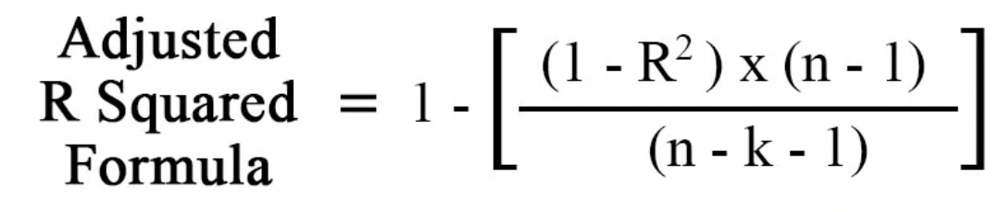

# Submission HW4 \| Fall 22

-   Ashish Dhiman \| [ashish.dhiman\@gatech.edu](mailto:ashish.dhiman@gatech.edu){.email}

-   Abhinav Arun \| [aarun60\@gatech.edu](mailto:aarun60gatech.edu){.email}

-   Anshit Verma \| [averma373\@gatech.edu](mailto:averma373@gatech.edu){.email}

[**\*Analysis Notes are marked with Red header: #Analysis**]{style="color:red"}

## Question 11.1 

```{r, warning=FALSE, message=FALSE}
library(ggplot2)
library(qqplotr)
library(cowplot)
library(reshape2)
library(grid)
library(MASS)
#install.packages("car")
library(car)
```

```{r}
crime_data<-read.table(file = "./uscrime.txt", sep = "\t",header=TRUE)
head(crime_data)
dim(crime_data)
```


```{r}
# Fitting the full model
# The full model has 15 independent variables 
full_model <- lm(Crime ~., data = crime_data)
summary(full_model)
```

```{r}
### Data Distribution and Pairwise Corelation
my_plots <- lapply(names(crime_data), function(var_x){
  p <- 
    ggplot(crime_data) +
    aes_string(var_x)
  if(var_x %in% list("So")) {
    p <- p + geom_bar()
  } else {
    p <- p + geom_density()
  } 
})
plot_grid(plotlist = my_plots)
### Correlation
cormat <- round(cor(crime_data),2)
cormat[upper.tri(cormat)] <- NA
melted_cormat <- melt(cormat)
# plotting the correlation heatmap
ggplot(data = melted_cormat, aes(x=Var1, y=Var2,
                                   fill=value)) +
geom_tile() +
geom_text(aes(Var1, Var2, label = value),
          color = "white", size = 3)
```

```{r}
#The "maximal" model is a linear regression model which assumes independent model errors and includes only main effects for the predictor variables.

#The "maximal" model is used as input for the stepAIC() function

# Stepwise regression model to choose the best model by AIC in a stepwise algorithm (shown with iterations)
step_model <- stepAIC(full_model, direction = "both")
summary(step_model)

```

```{r}
#Final model at the end of stepwise regression model
final_model<-stepAIC(full_model, direction = "both",trace=FALSE)
summary(final_model)

# Computing the Variance Inflation factor to see if multicolinearity issue exists in the final model
vif(final_model)

```

# Observations/Inferences : 

1. The initial full model has 15 independent predictor variables.  Whereas , our final model output of the Stepwise Regression Model has 8 important predictor variables that minimizes the AIC value . These variables are evaluated on using the combination of forward selection and backward elimination methods iteratively. The lower the AIC value , the better the model as AIC value estimates the relative amount of information lost by a given model in an effort to estimate the actual model (Info Theory).

2. Another point to note is that the Multiple R-squared of the final model is 0.789 which is lower than the initial model which has a value of 0.8031 but this is the pitfall of R squared value i.e. It will always increases with the increase in the # of variables without any penalty/adjustment for model complexity/overfitting unlike AIC or Adjusted R-squared.

3. If we observe Adjusted R squared value , it is higher for our final model with 8 independent predictor variables , thus the final model is validated to be better than the initial model on the basis of Adjusted R squared value too.



Based on the above formula , we can infer that the Adjusted R squared value decreases with the increase in # of independent variables(k) until and unless if there is a significant increase in the R squared value on adding a new variable. Thus both AIC and Adjusted R squared provide a technique for selecting simpler model which prevents overfitting.

4. Also , based on the correlation plot it could be seen that variables Wealth and Income Inequality are 2 highly correlated variables (-ve correlation), hence we should pick only 1 variable out of the 2. Same goes for Po1 and Po2. So , if we see our final model , it has just Ineq (Income Inequality) and Po1 (one out of each pair of correlated variables ) and thus our stepwise regression model handles it implicitly.

5. Since , the Variance Inflation factor for all the predictor variables in the final output is less than 5 , we can infer that the problem of multicollinearity also does not reside in our final model.
