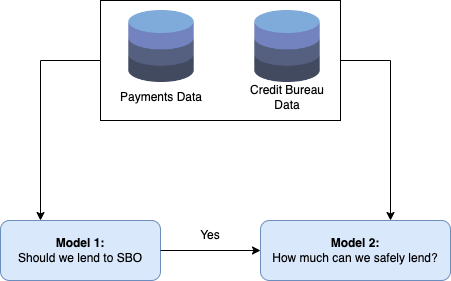

# Project Submission \| Fall 22

-   Ashish Dhiman \| [ashish.dhiman\@gatech.edu](mailto:ashish.dhiman@gatech.edu){.email}

-   Abhinav Arun \| [aarun60\@gatech.edu](mailto:aarun60gatech.edu){.email}

-   Anshit Verma \| [averma373\@gatech.edu](mailto:averma373@gatech.edu){.email}

#### Table of Contents

-   [Summary](#Summary)
-   [Backfround on Bharat Pe](#background)
-   [Analytics Usecases](#usecases)
-   [Usecase 1: Lending Activity](#usecase1)
-   [Usecase 2:](#usecase2)
-   [Usecase 3:](#usecase3)

## Summary {#summary}

BharatPe is an Indian fin-tech company operating mainly in the payments space and targeting Small Business Owners(SBOs). With the digital transformation of Indian economy in the recent years, the scale of digital payments has touched \~6M monthly transactions. BharatPe was one of the key players to ride this wave of digital (UPI) payments.

Access to this rich payments data lends itself to a variety of analytics use-cases, and as part of this course project, we try to discuss our ideas on some of those use-cases.

## Backfround on BharatPe and UPI {#background}

### BharatPe

[BharatPe](https://bharatpe.com/companyprofile)

### UPI

[UPI](https://www.npci.org.in/what-we-do/upi/product-overview)

monthly transactions. BharatPe was one of the key players to ride this wave of digital (UPI) payments.

Access to this rich payments data lends itself to a variety of analytics use-cases, and as part of this course project, we try to discuss our ideas on some of those use-cases.

monthly transactions. BharatPe was one of the key players to ride this wave of digital (UPI) payments.

Access to this rich payments data lends itself to a variety of analytics use-cases, and as part of this course project, we try to discuss our ideas on some of those use-cases.

### Analytics Usecases {#usecases}

## Usecase 1: Lending Activity {#usecase1}

One of the core competitive advantages of BharatPe at its inception was that it created a multiplatform UPI (QR code), which could be used with any 3rd party app to accept payments by the SBO. This greatly accelerated the on-boarding of SBOs to BharatPe, who were otherwise under serviced by the traditional lending players like Banks and NBFCs on account of high risk.

With access to payments made to the SBO, now we can reasonably approximate the revenue of the SBO, and therefore its credit worthiness. There are two parts to this problem as given in the schematic below:

```{r,echo=FALSE, out.width = "80%", fig.align = "center"}

```

### Classification Model: To Lend or not ?

### Regression Model: How much to lend ?

## Usecase 2: Personalisation Services
